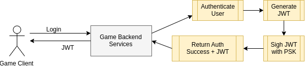
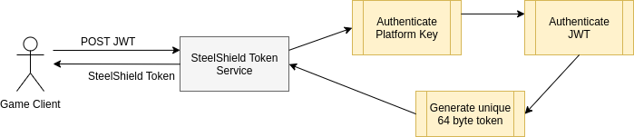
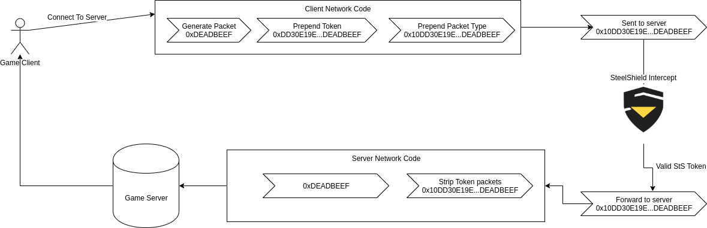

# Integration

There is an existing SteelShield plugin for Unreal Engine that can be used that makes it easy to integrate with your
Unreal Engine game. Please see [README.md](README.md) for more details.

The below sections describe how to implement your own version of the SteelShield Proof of Identity system.

## Step 1: Authenticating the User {#step1}

During the initial integration stage, Nitrado and the game developer generate and share a pre-shared key, as well as a platform key.

When the game client authenticates the user against it's backend servers, the backend server uses this pre-shared key to
generate a JWT that contains information about the connecting client and the game they are playing.

This JWT is returned to the game client.



### JWT Example

Below is an example of the JWT returned from the backend authentication server to the game client:

#### Encoded

```
eyJhbGciOiJSUzI1NiIsInR5cCI6IkpXVCJ9.eyJ1aSI6IlZhbGlkUGxheWVySUQ
yMyIsImV3cCI6MTYzNzk2NDU2MCwiaWF0IjoxNjA2NDA3NjA4fQ.VBysaikNEqK8
fzLHNmPIS6pMRgo6G_O2SJ7vU3pRUtSVmnCcWjKDOrmwvcpJDPhDpUmL1-Zhnwpp
WGlkVxiTqEqFOwHGRiFL_NP9BRpJshGuNLJy7YHEDZ1Draa6J7Dqvvix5rR2iHkf
2ne3PV_qWbXiQXXIN7rQxCCE1Uhal9S2mJ6N-HiMZAloMhavh4oS8dquh5Wy8b-T
_AOp9McnuRDbMzGO437qQvljU6EZCDofR54zfSWkS8P3hTkS7_bJE5tvNiP4eLuu
8YstPI_W8CvOivh8RlFtJ4GXDK1mdZLP6T2BSFxNU1FTjrHiQXgYlTfq0sCIhWVS
X5kI4g8yVg
```

#### Decoded

```json
header
{
  "alg": "RS256", # asymmetric: require private + public key
  "typ": "JWT"
}
 
claims
{
  "ui": "ValidPlayerID23",
  "exp": 1637964560,
  "iat": 1606407608
}
 
signature
{....}
```

#### Public Key

```
-----BEGIN PUBLIC KEY-----
MIIBIjANBgkqhkiG9w0BAQEFAAOCAQ8AMIIBCgKCAQEAuYpxcu3oZD1PO2eEm+bk
fzdSqxWmiKHYhf3AX/c2BSnNBuuhuau04Cn3Cz3fvWKOhryyx/830qOeuV4pi3Qf
tMrQOKOQ8LgoGsxVjhQvy6L3hIjgvKHK+YRgeiLznQZjUhIVvxW6noy9OUd67FfO
j14qD2Lwusoyx/u6vpjpCxsYRs4vyagfRDQQYxVciMrtussyWyem7Zj6S8C/YNW0
W/akpGHPo5Dvvb8mxrpDF7PJY1Avh0qoldu1/4SMClU5ZmSZxshPHCwzMKl8tUcL
70dPTtxZpE3ZRtyPxcd0HWGFzU88P1vHp+cJEi16UcLPqRJuQILNLHOOF/OQy474
RwIDAQAB
-----END PUBLIC KEY-----
```

## Step 2: Acquiring the SteelShield Token {#step2}

Once the game client has the JWT generated by the games backend authentication server, it sends the JWT to the
SteelShield Token Service.

The job of the SteelShield Token Service is to validate the JWT using various properties of the token itself. 
Which properties these are depends on the individual implementation and the backend service used to authenticate 
the player.

This process is done via a HTTP POST request to an API endpoint that contains details about the developer, game,
platform etc. This HTTP endpoint will be communicated to the Developer by Nitrado during the integration process.



The URL will take the structure below

```http
POST /v{N}/{developer}/{game}/{platform}/tokens
```

As an example

```http
POST /v1/greatpublishing/thewilderness/xbox/tokens
```

### POST Header

The HEADER of the POST request contains an `Authorization` section which specifies the platform key.

```http
Authorization: <PLATFORM_KEY>
```

### POST Body

The BODY of the POST then provides more information about the game client, and most importantly the JWT which was
generated by the backend game server during player authentication.

The fields which need to be included in the BODY are:

1. Environment: **production** or **development**
2. Auth Provider: What system was used to generate the JWT. This will by the name of the development studio for custom
   integration
3. Game Client Token: The JWT that was generated by the backend game server during authentication of the player
4. Client Version: The version of the game making the request

An example of the POST BODY

```json
{
    "environment": "production",
    "authProvider": "greatpublishing",
    "gameClientToken": "eyJhbGciOiJSUzI1NiIsInR5cCI6Ikp...X5kI4g8yVg",
    "clientVersion": "1.0.1"
}
```

In response to a valid request containing the valid JWT, the server will respond with a **200** status code and a json
payload with the following fields

1. Issuer: Should almost always be *SteelShieldTokenService*
2. Issued At: The timestamp the token was issued at
3. Token: The long version of the SteelShield token to be used for wrapping the network packets

An example of the response

```json
{
  "Issuer": "SteelShieldTokenService",
  "IssuedAt": 1606406887,
  "Token": "3TDhnmjmHrRrhQPQ3yYpDfOFstpyfb3cBwAAAOfSv1/7s/boy7Z3j
            DMVWcMfRWFRmt6uZcfQCR+UyYFypWnXAA=="
}
```

The token returned by SteelShield Token Service will be a **base64** encoded string. When decoded, it will be **64
bytes**

An example

```bash
$ echo "3TDhnmjmHrRrhQPQ3yYpDfOFstpyfb3cBwAAAOfSv1/6s/boy7Z3j \
        DMVWcMfRWFRmt6uZcfQCR+UyYFypWnXAA==" | base64 -d | xxd
 
00000000: dd30 e19e 68e6 1eb4 6b85 03d0 df26 290d  .0..h...k....&).
00000010: f385 b2da 727d bddc 0700 0000 e7d2 bf5f  ....r}........._
00000020: fbb3 f6e8 cbb6 778c 3315 59c3 1f45 6151  ......w.3.Y..EaQ
00000030: 9ade ae65 c7d0 091f 94c9 8172 a569 d700  ...e.......r.i..
```

## Step 3: Initial Connection to Game Server {#step3}

With a new token from the SteelShield Token Service, the game client can begin communication with the game server
directly.

During communication with the game server, the game client will need to prefix all network packets with a leading byte
indicating the type of data in the prefix, and then either the whole SteelShield token, the short version of the token,
or the short token and the rollover token.

The initial packet to the game server should contain the whole 64 bytes of the SteelShield token, and a leading byte
indicating that it is an initial connection packet.

The leading byte will be one of the following:

| Byte | Description               |
|------|---------------------------|
| 0x02 | Rollover Request          |
| 0x04 | Rollover Ack              |
| 0x08 | Short Token/Game Packet   |
| 0x10 | Long Token/Initial Request|

The final packet will have this structure

| Packet Type | Full StS Token        | Game Data  |
|-------------|-----------------------|------------|
| 0x10        | 0xDD30E19E68E61EB4... | 0xDEADBEEF |

SteelShield will intercept the packet, check the first byte, see that it is a initial connection request, and then read and
validate the full 64 byte token.

If the full token is correctly validated as one generated by the SteelShield Token Service, and the IssuedAt time of the
token has not expired, the packet is forwarded on to the server **as is**

::: warning IMPORTANT
SteelShield does not modify the packet in any way. The game server will receive the packet just as it was sent from the 
game client, including the token prefix.

It is up to the game servers network code to strip the leading token from the network packet before passing it up the
chain to the game logic.
:::

The logic from the client side would look like the following:

1. Create the initial connection packet as normal (eg 0xDEADBEEF)
2. Prepend the full SteelShield token to the network packet (eg 0xDD30E19E...DEADBEEF)
3. Prepend the Initial Request (0x10) packet type indicator to the network packet (eg 0x10DD30E19E...DEADBEEF)
4. Send the packet over the network

The logic from the server side would look like the following:

1. Receive packet from the network (eg 0x01DD30E19E...DEADBEEF)
2. Strip the first 64 + 1 bytes from the beginning of the packet (eg 0x10DD30E19E...DEADBEEF)
3. Pass the packet up the stack to be processed by the reset of the game server logic (eg 0xDEADBEEF)

::: info
Since SteelShield is only involved in the path from the client to the server (`Client→SteelShield→Server`), and direct 
server return is used for sending network traffic back from the server to the client, there is no need to prefix and strip 
the network traffic in the `Server→Client` communication.
:::



## Step 4: Continuous Communication with the Game Server {#step4}

After the Initial Connection to the Game Server is established, and SteelShield has authenticated the clients
connection, the game client can switching to using a short version of the SteelShield Token.

The short version of the token is the first 4 bytes of the token, with the least significant bit set to 0.

For example, given the full 64 byte token `DD30 E19E 68E6 1EB4 6B85 03D0 DF26 290D...`, the short token will be the
first 4 bytes `DD30 E19E` with the LSB set to 0. In this example, the LSB is already 0, so no difference is seen in the
token.

In binary, the short token would look like `0b1110 0001 1001 1110` where the LSB (0b111**0**) is already 0.

This short token is then prepended to all network packets travelling from the client to the server, along with the first
byte being set to `0x08` to indicate that the packet contains a short token.

SteelShield will intercept the packet, look at the first byte, identify it as a short token, and then look up the short
token in its state table to make sure the client has previously sent though a valid long token, and that the token is
still valid (ie. within 15 minutes of the IaT)

| Packet Type | Short StS Token | Game Data |
|-------------|-----------------|-----------|
| 0x08        | 0xDD30E19E      | 0x0C0FFEE |

The network packets follow the same process as in the initial connection phase, where only the client to server 
(`Client→SteelShield→Server`) needs to have the token prepended. Likewise, SteelShield does not modify the packets in 
any way and it is up to the server to strip the leading 4 + 1 bytes before processing it by the game.

## Step 5: Token Rollover Sequence

A SteelShield Token is only valid for a period of time before SteelShield considers it expired and discards any game packets
(`0x08`) that contain it. There is some leeway by the SteelShield process on how longer after the expiry period is reached
before it starts discarding the packets to allow a smooth rollover process, but it is strongly advised to work on a 15 minute 
schedule.

The purpose of expiring tokens after a period of time is to ensure that previously issued tokens can not be used in a DDoS
attack. By requiring a token refresh, SteelShield can ensure the connection is always for a validated client.

The rollover process would happen during normal communication with the server, where instead of sending an initial
connect packet type (`0x10`) or a gameplay packet (`0x08`), the game client requests a new SteelShield Token from the
SteelShield Token Service as described in [Step 2](#step2), and then sends a Rollover packet type (`0x02`) along with the old
short token and the new full token to the server.

The least significant bit in the short version of the token would be set to 1.

For example, given the short token `DD30 E19E` (`0b1110 0001 1001 1110`) the LSB would be flipped to 1, resulting in
`DD30 E19F` (`0b1110 0001 1001 1111`).

| Packet Type | Short StS Token | New StS Token       | Game Data |
|-------------|-----------------|---------------------|-----------|
| 0x02        | 0xDD30E19F      | 0xCCFA58DA4C85D4... | 0x0COFFEE |

SteelShield will intercept the packet, identify it as a rollover token, validate that the initial short token, and then
swap it out in its state table with the new token provided in the rollover.

From then on, the game client will use the short version of the newly acquired for continuous communication with the
server like in [Step 4](#step4).

::: warning IMPORTANT
The Game Server should implement a response mechanism to the client to acknowledge the receipt of the rollover token
packet. The Game Client should continue to send the full rollover sequence as above until it receives some sort of
indication back from the Game Server that all is well.

Since UDP traffic is not guaranteed to reach its indented target, if the client only sends the rollover sequence once
and it does not reach the target, then the client could be disconnected due to SteelShield not being able to identify
the incoming token. 

If the network protocol being used already has some kind of reliability check (resending missed packets), then this 
response mechanism is not required.
:::
