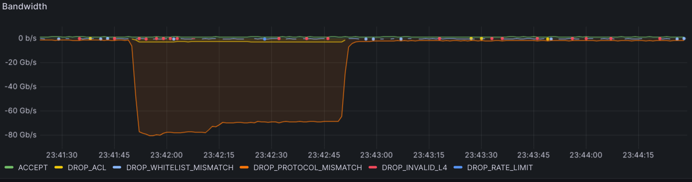
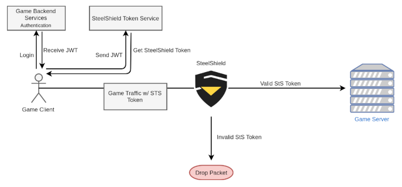

# Introduction

## Overview

SteelShield is a DDoS protection suite for game servers by Nitrado. Unlike other DDoS protection systems, SteelShield is
designed specifically to protect game servers in a real-time manner, rather than using a delayed metric to determine
that an attack has started.

The motto of SteelShield is *"No bad packets reach the game server"*.

SteelShield achieves this by sitting on the network between the game client and the game server, and inspecting each
packet that passes through it to identify it as a *good* or *bad* packet. Care is taken to ensure that SteelShield
operates as close to line rate as possible so as to have no impact on the server latency.

While SteelShield has protection mechanisms for identifying a filtering generic network traffic, by far the most
effective solution is integration of SteelShield's Proof of Identity system into the game by the game developer.

This Proof of Identity system ensures that the client and their connection is validated before connecting to the actual 
game server, and SteelShield is in turn able to very quickly authenticate any packets destined for the protected game
server.

The Proof of Identity system works by including a pre-determined token in each network packet that SteelShield can
validate and track back to a previously authenticated account. If the network packet includes a valid token, it
is forwarded to the game server. If it does not include a valid token, SteelShield drops the packet on the network.

Tokens are pre-computed during the authentication phase so no additional resources are consumed during the sending or
receiving of the network packets.

Below is an example of a server that is protected by SteelShields Proof of Identity system. The downward facing orange
graph indicates traffic that failed the Proof of Identity check and was discarded by SteelShield before reaching the
server. While the green flat line (barely visible) shows the traffic which passed the Proof of Identity check and was
forwarded to the Game Server.

## How it works

SteelShield offers a computationally unbreakable DDoS protection by tying all traffic to an authenticated player account.

The client establishes an authenticated user session with the Game Backend Services in control of the game developer or 
publisher. When establishing this session, the client receives a Game Client Token, which is a JWT that proves that the 
bearer of this token is the owner of the associated player account. The Game Client Token is signed using an asymmetric 
encryption algorithm, which allows third parties to validate it, if they have access to the respective public key.

The client also has access to a static Platform Key that is baked into the client software, unique per game platform, 
and has been communicated to Nitrado.

The client sends both, the Game Client Token and the Platform Key to the SteelShield Token Service, which is operated 
by Nitrado. If both secrets are valid, the SteelShield Token Service returns a SteelShield Long Token. Consequently, 
only authenticated user accounts can gain access to such a token.

When communicating to game servers, the client embeds the SteelShield Long Token into its traffic. On initial connect 
and on renewal of the token, the SteelShield Long Token is sent in full, and every packet of game traffic contains a 
small part of this full token, as described below.

SteelShield inspects all traffic and only allows traffic that stems from a valid SteelShield Long Token, and therefore 
from an authenticated player. All other packets are dropped.

The only way for an attacker to send malicious traffic towards a server is by abusing their own account to receive a 
SteelShield Long Token. However, abuse of a player's own SteelShield Long Token can be traced back to that user account, 
and enforcement actions can be taken.

The SteelShield long token can only be used once to prevent replay attacks. If the user has verified themselves using a 
long token, depending on the implementation, it is still ensured that the packets behave in accordance with their 
specification. This requires SteelShield to have details of the network protocol used. Other values such as the number 
of packets per second that a legitimate client can send can also be specified to prevent misuse.

***
**NOTE**

> Platform Keys are static secrets that are included in the game client software. On consoles 
> this holds relatively strong security guarantees, while on PC the token can be 
> reverse-engineered quite easily.
> 
> Because of that, SteelShield's security model does not rely on the Platform Keys. Platform 
> Keys are an additional factor that makes it harder for attackers to create artificial 
> requests towards the SteelShield Token Service, and they also make it easier for Nitrado 
> staff to track reverse-engineering attempts and breaches. However, even with the Platform 
> Keys are made public, all security guarantees still hold, and sending traffic to a game 
> server still requires an authenticated user account.

***

