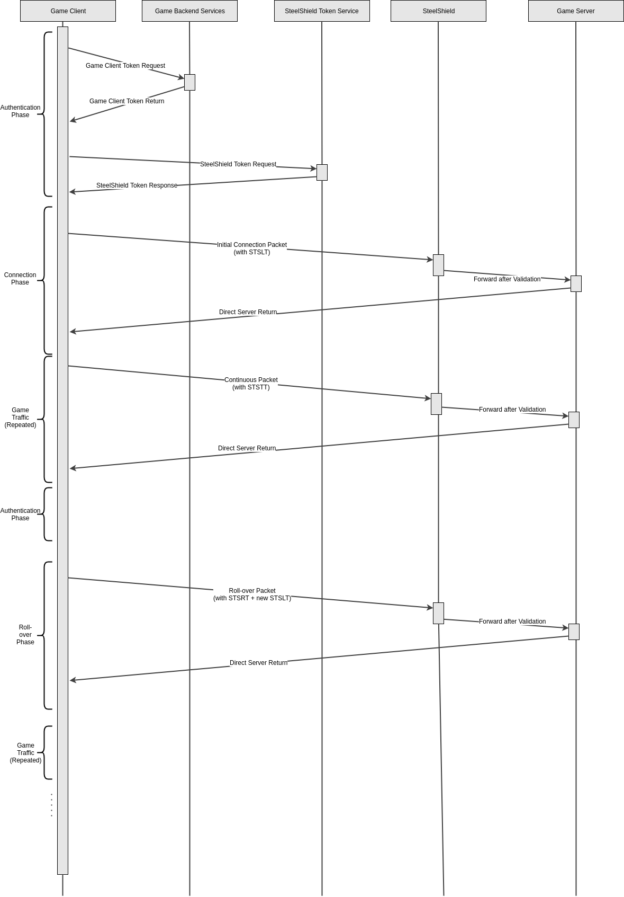

# Pseudo Code

## Game Client

```typescript
var jwt = AuthenticateWithBackend("AzureDiamond", "hunter2")
var token = RequestSteelShieldToken(jwt)

var connect_packet = CreateConnectionPacket("192.168.1.1", 5432)
var packet = 0x10 + token + connect_packet

connected = SendNetworkPacket(packet)

var short_token = token[0:4]

while (connected) {
    var game_packet = CreateGamePacket()

    if (!rollover_time) {
        var packet = 0x08 + SetLSBTo0(short_token) + game_packet
    } else {
        token = RequestSteelShieldToken(jwt)
        var packet = 0x02 + SetLSBTo1(short_token) + token + game_packet
        short_token = token[0:4]
    }

    SendNetworkPacket(packet)
}
```

## Game Server

```typescript
while (running) {
    var packet = ReceiveNetworkPacket()

    if (packet[0] == 0x10) {
        var stripped_packet = packet[65:]
    } else if (packet[0] == 0x08) {
        var stripped_packet = packet[5:]
    } else if (packet[0] == 0x02) {
        var stripped_packet = packet[70:]
        SendRolloverACKToClient()
    }

    ProcessPacket(stripped_packet)
}
```

## Game Backend Server

```typescript
var client = AcceptClientConnection()

var valid_client = AuthenticateClient(client)

if (valid_client) {
    var jwt = CreateNewJWT(client)
    var signed_jwt = SignJWT(jwt, nitrado_secret_key)
    SendAuthResponse(true, signed_jwt)
} else {
    SendAuthResponse(false, 0)
}
```


